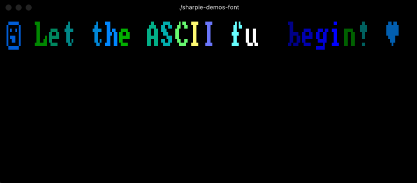
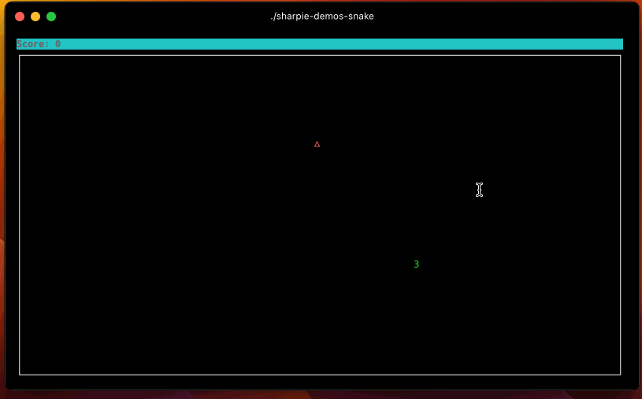

# Sharpie

[](https://github.com/pavkam/sharpie/actions/workflows/sharpie-publish.yml)

[](https://github.com/pavkam/sharpie/actions/workflows/build-ncurses.yml)
[](https://github.com/pavkam/sharpie/actions/workflows/build-pd-curses.yml)
[](https://github.com/pavkam/sharpie/actions/workflows/build-pd-curses-mod.yml)
[](https://github.com/pavkam/sharpie/issues)
[](https://raw.githubusercontent.com/pavkam/sharpie/main/LICENSE)

[](https://www.nuget.org/packages/Sharpie-Curses)


**Sharpie** is a terminal manipulation library based on NCurses and targeting .NET 6 (dotnet core) and above.



**Or, if you prefer the Snake game...**



> 📚 **[📖 Complete Documentation Available Here](https://pavkam.dev/sharpie/api/Sharpie.html)** 📚
>
> Get started with comprehensive guides, API references, and examples!

## Supported platforms

**Sharpie** supports any platform that **.NET 9.0+**, **[ncurses](https://github.com/mirror/ncurses)**, **[pdcurses](https://github.com/wmcbrine/PDCurses)** and **[pdcurses-mod](https://github.com/Bill-Gray/PDCursesMod)** support. This essentially means that `Linux`, `Macos` and `Windows` are supported on both `x64` and `ARM64` architectures.

For more information on supported platforms visit [.NET Supported Platforms Page](https://github.com/dotnet/core/blob/main/release-notes/6.0/supported-os.md) and [NCurses Packages Page](https://invisible-island.net/ncurses/#packages).

**Sharpie** provides unofficial builds for all the supported libraries located in [the lib directory](https://github.com/pavkam/sharpie/tree/main/lib)

## Installation

Install the main library by adding the NuGet package:

```sh
dotnet add package Sharpie-Curses
```

Additionally, one can install packages containing prebuilt native libraries. These packages are useful when targeting platforms that do not bundle a supported curses library by default (e.g. Windows).

```sh
dotnet add package Sharpie-Libs-PdCurses
dotnet add package Sharpie-Libs-PdCursesMod
dotnet add package Sharpie-Libs-NCurses
```

## Features

Almost all of Curses functionality is exposed through **Sharpie**. What follows is a list of supported features:

1. `Terminal` allows interfacing with terminal functionality exposed by Curses,
2. `Screen` abstracts away the screen handling,
3. `Pad` abstracts away the off-screen windows (known as pads),
4. `SubPad` and `SubWindow` carves out areas of their respective parents for easy management,
5. `EventPump` allows developers to listen for Curses events such as key presses, mouse moves and resizes,
6. `ColorManager` abstracts away the management of colors,
7. Even `SoftLabelKeys` are supported (though antiquated),

In addition to wrapping NCurses, this library also adds numerous quality-of-life improvements such as:

1. Management of overlapping `Window`s within a `Screen`,
2. Proper `Window` resizing and placement during terminal resizing events,
3. Automatic `Screen` refresh management and support for _atomic_ refreshes,
4. Supports `SynchronizationContext`-type execution,
5. Supports protected/synchronized or raw access to all classes,
6. And other small additions here and there...

## Reasons

There are a number of libraries out there that already offer bindings to _NCurses_. One of the more popular one is [Terminal.Gui](https://github.com/gui-cs/Terminal.Gui); and others such as [dotnet-curses](https://github.com/MV10/dotnet-curses) also exist.

So why another one? The are many reasons, but the most important ones are:

1. There is no .NET, object-oriented version of NCurses bindings,
2. Existing versions are old, or are targeting old versions of .NET which do not benefit from numerous advances in the .NET platform,
3. No other library exposes most of Curses functionality,
4. Testing is either very limited or completely non-existent.
5. And finally -- **because I wanted to dabble in Curses**.

## How To

What follows is a small example of how to use the library:


```csharp

// Create the terminal instance without any non-standard settings.
using var terminal = new Terminal(CursesBackend.Load(), new(ManagedWindows: true));

// Set the main screen attributes for text and drawings.
terminal.Screen.ColorMixture = terminal.Colors.MixColors(StandardColor.Green, StandardColor.Blue);

// Draw a border on the screen.
terminal.Screen.DrawBorder();

// Force a refresh so that all drawings will be actually pushed to teh screen.
terminal.Screen.Refresh();

// Create a child window within the terminal to operate within.
// The other cells contain the border so we don't want to overwrite those.
var subWindow = terminal.Screen.SubWindow(
    new(1, 1, terminal.Screen.Size.Width - 2, terminal.Screen.Size.Height - 2));

// Process all events coming from the terminal.
foreach (var @event in terminal.Events.Listen(subWindow))
{
    // Write the  event that occurred.
    subWindow.WriteText($"{@event}\n");
    
    // If the event is a resize, change the size of the child window
    // to allow for the screen to maintain its border.
    // And then redraw the border of the main screen.
    if (@event is TerminalResizeEvent re)
    {
        subWindow.Size = new(re.Size.Width - 2, re.Size.Height - 2);
        terminal.Screen.DrawBorder();
    }
    
    // If the user pressed CTRL+C, break the loop.
    if (@event is KeyEvent { Key: Key.Character, Char.IsAscii: true, Char.Value: 'C', Modifiers: ModifierKey.Ctrl })
    {
        break;
    }
}
```

As you can imagine, there are numerous other uses built into the library. Start out by reading [Setting Up The Terminal](https://github.com/pavkam/sharpie/wiki/Setting-Up-the-Terminal) wiki page.

## License

[Contributors] [./CONTRIBUTORS.md]
[BSD 3-Clause License](./LICENSE)
