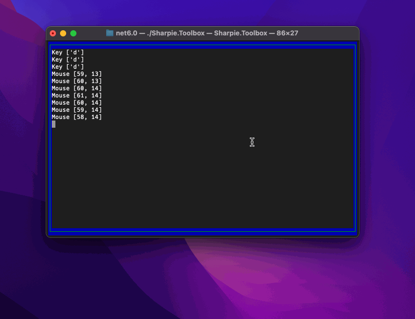

[](https://github.com/pavkam/sharpie/actions/workflows/build-test-and-release.yml)
[](https://www.nuget.org/packages/Sharpie-Curses)

# Sharpie
**Sharpie** is a terminal manipulation library based on Curses and targeting .NET 6 (dotnet core).

# Reasons
There are a few libraries out there that already offer bindings to *NCurses*. One of the more used one is [Terminal.Gui](https://github.com/gui-cs/Terminal.Gui). But uthers such as [dotnet-curses](https://github.com/MV10/dotnet-curses) also exist.

So why another one? The are many reasons, but the most important ones are:
1. There is no .NET, object-oriented version of pure Curses,
2. Existing versions are old, or are targeting old versions of .NET which do not benefit from numerous advances in the .NET platform,
3. No other library exposes all of curses functionality,
4. Testing is either very limited or completely non-existent.
5. And finally -- **because I wanted to dabble in Curses**.

# How To
What follows is a small example of how to use the library:



```csharp
// Create the terminal instance without any non-standard settings.
using var terminal = new Terminal(NativeCursesProvider.Instance, new());

// Set the main screen attributes for text and drawings.
terminal.Screen.ColorMixture = terminal.Colors.MixColors(StandardColor.Green, StandardColor.Blue);

// Draw a border on the screen.
terminal.Screen.DrawBorder();

// Force a refresh so that all drawings will be actually pushed to teh screen.
terminal.Screen.Refresh();

// Create a child window within the terminal to operate within.
// The other cells contain the border so we don't want to overwrite those.
using var subWindow = terminal.Screen.CreateWindow(
    new(1, 1, terminal.Screen.Size.Width - 2, terminal.Screen.Size.Height - 2));

// Process all events coming from the terminal.
// Note that one can provide a `CancellationToken` to interrupt this process.
foreach (var @event in subWindow.ProcessEvents(CancellationToken.None))
{
    // Write the  event that occured.
    subWindow.WriteText($"{@event}\n");
    
    // If the event is a resize, change the size of the child window
    // to allow for the screen to maintain its border.
    // And then redraw the border of the main screen.
    if (@event is TerminalResizeEvent re)
    {
        subWindow.Size = new(re.Size.Width - 2, re.Size.Height - 2);
        terminal.Screen.DrawBorder();
    }
    
    // If the user pressed CTRL+C, break the loop.
    if (@event is KeyEvent { Key: Key.Character, Char.IsAscii: True, Char.Value: 'C', Modifiers: ModifierKey.Ctrl })
    {
        break;
    }
}

// Dispose the terminal so that we restore the proper console mode.
terminal.Dispose();
```
As you can imagine, there are numerous other uses built into the library.
